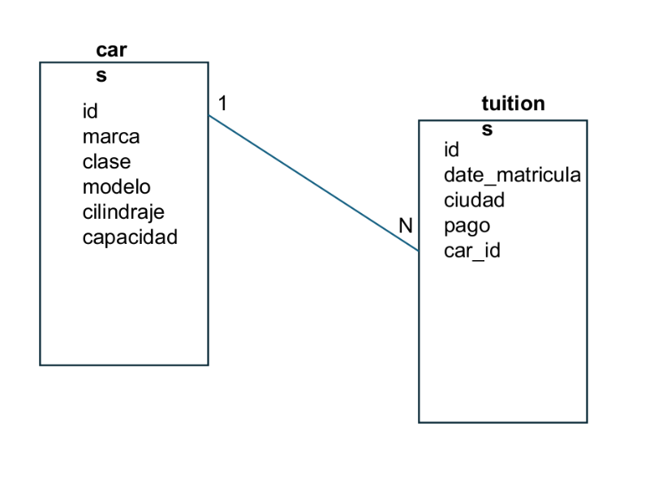
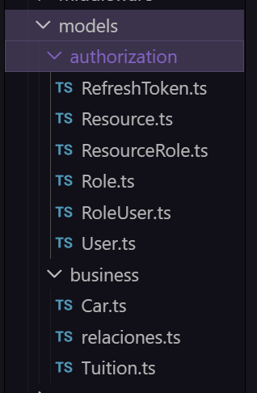
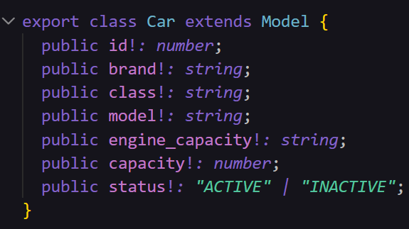
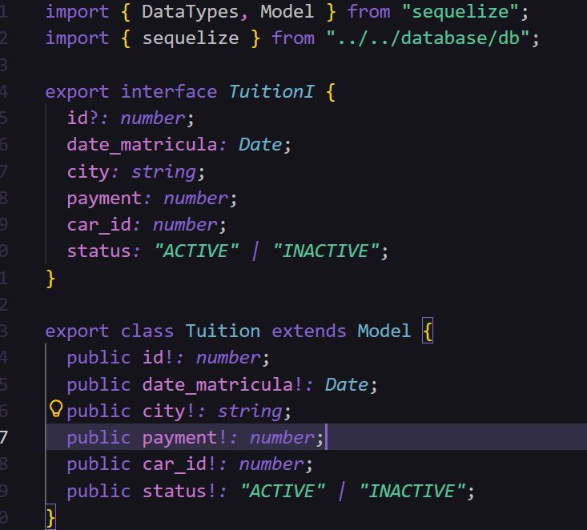

# PARCIAL 2

Iniciamos creando los modelos de la base de datos siguiendo la guía ortorgada:

Creamos incuso los modelos de authorization pero no se usaron más, así que nos enfocaremos en los del negocio:

Utilizamos la ia ChatGPT para crear los atributos. Lo hicimos en inglés, como suele recomendarse:

Todo nos quedó en el archivo Cars.ts y Tuition.ts dentro de la carpeta business en src > models.

