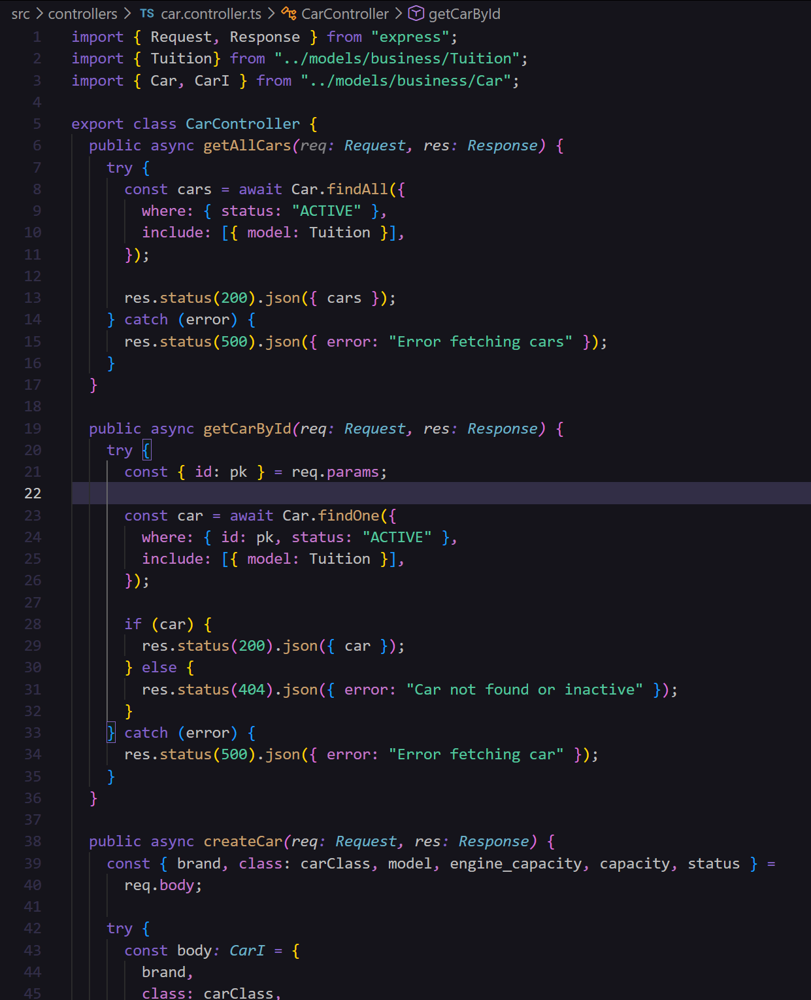
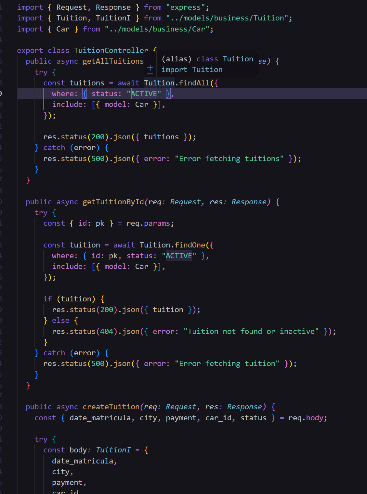
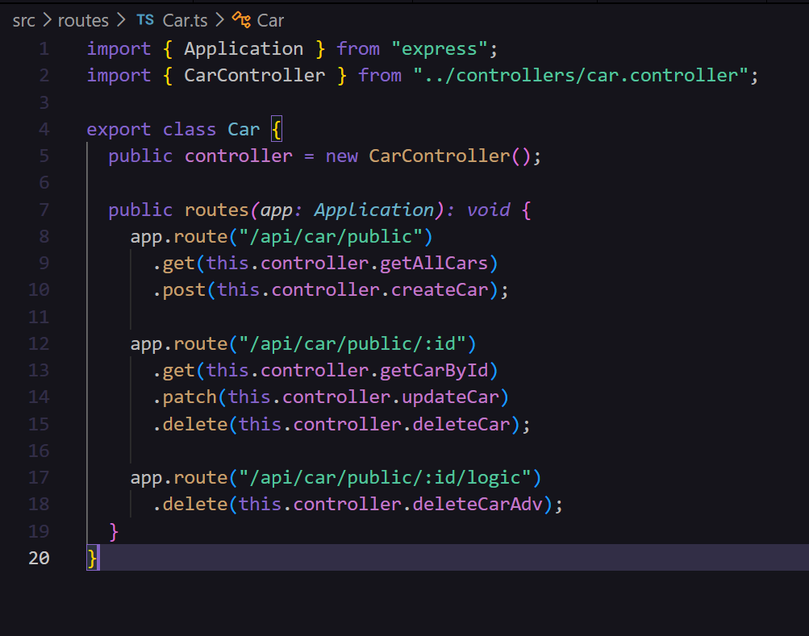
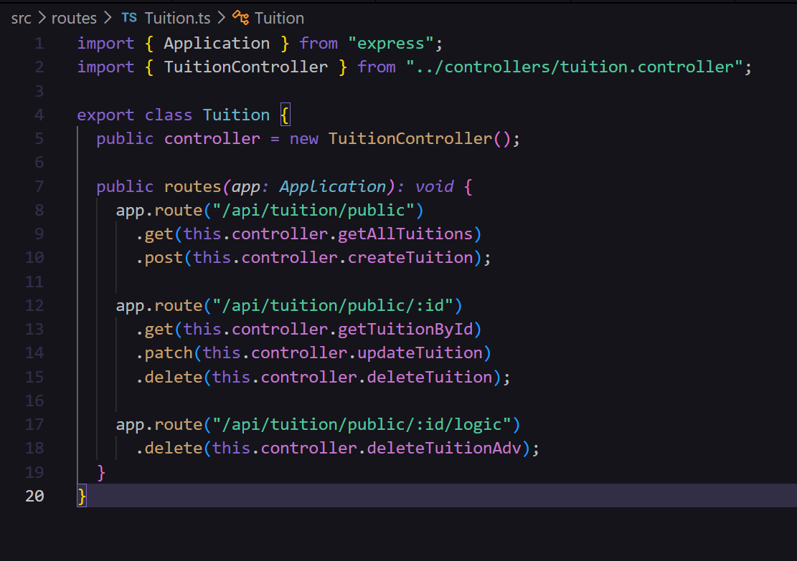

# PARCIAL 2

Iniciamos creando los modelos de la base de datos siguiendo la guía ortorgada:

Creamos incuso los modelos de authorization pero no se usaron más, así que nos enfocaremos en los del negocio:

Utilizamos la ia ChatGPT para crear los atributos. Lo hicimos en inglés, como suele recomendarse:

Cars.ts:

Tuition.ts:

Todo nos quedó en el archivo Cars.ts y Tuition.ts dentro de la carpeta business en src > models.

Creamos también los controladores de Cars y de Tuitions, usamos tambien para agilizar ayuda de la ia ChatGPT.

car.controller.ts:

tuition.controller.ts:

Agregamos también las rutas individuales:

Ruta de Cars:

Ruta de Tuitions:

